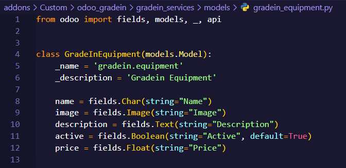
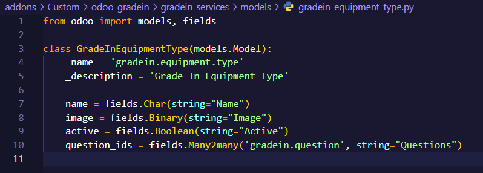
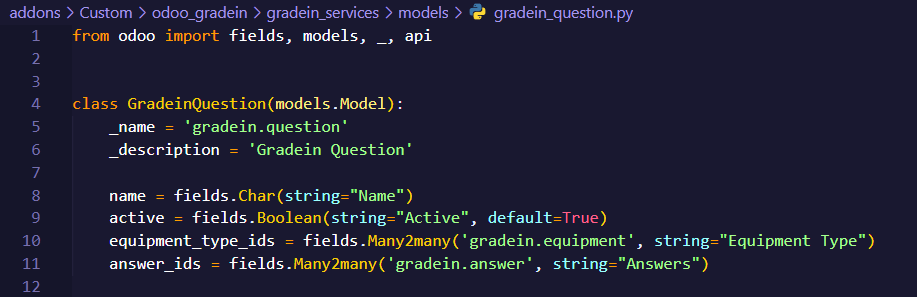
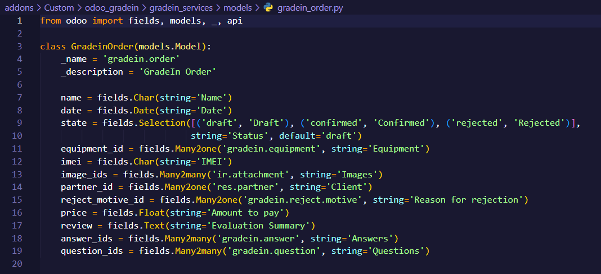

# README - Modelo de Odoo con Python para GradeIn Service

Gracias por elegir nuestra aplicación para gestionar eficientemente los procesos de canje de celulares. A continuación, encontrarás información útil para comenzar.

### Notas Adicionales

- Cualquier problema identificado durante el proceso de aceptación se documentará y abordará de manera adecuada.
- La aceptación final estará sujeta a la aprobación del equipo de desarrollo y los interesados.
- Fecha de Inicio: 4-12-2023
- Fecha de Finalización: 15-12-2023

### Proceso de Aceptación

- La app tendra dos tipos de usuarios: Vendedor y administrador. El administrador tendra todos los accesos disponible a todos los modelos, en cambio el vendedor solo
tendra permisos para crear y editar en las vistas.
- Pruebas Manuales: Se realizarán pruebas manuales exhaustivas para verificar cada uno de los criterios de aceptación.
- Revisión del Código: El código asociado de los modelos serán revisado para asegurar buenas prácticas de programación, coherencia y legibilidad.
- Revisión de Documentación: La documentación asociada al modelo y cualquier instrucción de configuración también será revisada.
- Validación del Usuario Final: Se llevará a cabo una validación final con usuarios finales para garantizar que la aplicación cumple con sus expectativas y necesidades.

## **Modelo gradein_equipment**

### Objetivo

Este documento define los criterios y el proceso de aceptación para garantizar que la implementación del modelo Gradein Equipment cumpla con los requisitos y expectativas del proyecto.

### Estructura del Modelo

### Campos Principales

- Name (Char): Texto de la respuesta.
- Image (Image): Imagen representativa del equipo.
- Description (Text): Descripción detallada del equipo.
- Active (Boolean): Indica si el equipo está activo.
    - Valor predeterminado: True.
- Price (Float): Precio del equipo en la moneda local.

### Criterios de Aceptación

- Funcionalidad Básica:
    - La equipo debe contener un campo de texto (name) que sea obligatorio y única.
    - El estado de activación/desactivación (active) debe reflejarse correctamente en la interfaz y afectar la disponibilidad del equipo.
    - La aplicación debe admitir la carga de imágenes representativas para cada equipo a través del campo image.
    - El campo description debe permitir la introducción y visualización de descripciones detalladas para cada equipo.
    - El campo price debe permitir la introducción de valores numéricos para representar el precio del equipo.

- Recuperación de Datos: La aplicación debe ser capaz de recuperar y mostrar correctamente las respuestas almacenadas en el modelo Gradein Equipment. 
- Métodos y Lógica Adicional: Los métodos y la lógica adicionales, si se implementan, deben ejecutarse según lo previsto sin errores ni efectos secundarios no deseados.

---

## **Modelo gradein_equipment_type**

### Objetivo

El modelo Gradein Equipment Type es esencial en nuestra aplicación para gestionar tipos de equipos. A continuación, se presenta la estructura del modelo junto con una explicación detallada de los campos principales.

### Estructura del Modelo

### Campos Principales

- Name (Char): Nombre del tipo de equipo.
- Image (Image): Imagen representativa del tipo de equipo.
- Active (Boolean): Indica si el equipo está activo.
    - Valor predeterminado: True.
- Question_ids (Many2many): Preguntas asociadas al tipo de equipo.
    - Ayuda: Preguntas que están relacionadas con este tipo de equipo.

### Criterios de Aceptación

- Funcionalidad Básica:
    - La respuesta debe contener un campo de texto (name) que sea obligatorio y único para cada equipo.
    - La aplicación debe admitir la carga de imágenes representativas para cada tipo de equipo a través del campo image.
    - El estado de activación/desactivación (active) debe reflejarse correctamente en la interfaz y afectar la disponibilidad de la respuesta.

- Asociación con Preguntas:
    - La relación question_ids debe permitir la asociación correcta de preguntas al tipo de equipo.
    - La eliminación de un tipo de equipo no debe afectar negativamente a las preguntas asociadas.

- Recuperación de Datos: La aplicación debe ser capaz de recuperar y mostrar correctamente las respuestas almacenadas en el modelo Gradein Equipment Type.

---
## **Modelo gradein_question**
### Objetivo
El modelo Gradein Question es esencial en nuestra aplicación para gestionar de manera efectiva las preguntas que despues van hacer asociadas al modelo de respuestas que van a tener los equipos. Este modelo está diseñado con campos específicos que son fundamentales para la configuración de la vista y garantizar una experiencia de usuario fluida.

### Estructura del Modelo

### Campos Principales
- Name (Char): Texto de la respuesta.
- Active (Boolean): Indica si el equipo está activo.
    - Valor predeterminado: True.
- Equipmente_type_ids (Many2many): Tipos de equipos asociados a la pregunta.
- Answer_ids (Many2many): Respuestas asociadas a la pregunta.

### Criterios de Aceptación
- Funcionalidad Básica:
    - La respuesta debe contener un campo de texto (name) que sea obligatorio y única.
    - El estado de activación/desactivación (active) debe reflejarse correctamente en la interfaz y afectar la disponibilidad de la pregunta.
    - El campo equipment_type_ids debe permitir la asociación correcta de tipos de equipos a la pregunta.
    - El campo answer_ids debe permitir la asociación correcta de respuestas a la pregunta.

- Recuperación de Datos: La aplicación debe ser capaz de recuperar y mostrar correctamente las respuestas almacenadas en el modelo Gradein Question.
- Integración con el Modelo de Preguntas: La aplicación debe integrarse correctamente con el modelo de respuestas (gradein.answer).

---
## **Modelo gradein_answer**

### Objetivo

El modelo Gradein Answer es esencial en nuestra aplicación para gestionar de manera efectiva las respuestas asociadas al modelo de preguntas. Este modelo está diseñado con campos específicos que son fundamentales para la configuración de la vista y garantizar una experiencia de usuario fluida.

### Estructura del Modelo

### Campos Principales

- Name (Char): Texto de la respuesta.
- Active (Boolean): Indica si el equipo está activo.
    - Valor predeterminado: True.
- Price_reduction (Float): Cantidad para reducir el precio.

### Criterios de Aceptación

- Funcionalidad Básica:
    - La respuesta debe contener un campo de texto (name) que sea obligatorio y única.
    - El estado de activación/desactivación (active) debe reflejarse correctamente en la interfaz y afectar la disponibilidad de la respuesta.
    - El campo price_reduction debe ser editable y permitir valores numéricos.
    - La introducción de un valor en price_reduction debe reflejarse correctamente en la interfaz y en el modelo de datos. 

- Recuperación de Datos: La aplicación debe ser capaz de recuperar y mostrar correctamente las respuestas almacenadas en el modelo Gradein Answer. 
- Integración con el Modelo de Preguntas: La aplicación debe integrarse correctamente con el modelo de preguntas (gradein.question) y permitir la asociación correcta de respuestas a preguntas.

---

## **Modelo gradein_order**

### Objetivo

Este documento define los criterios y el proceso de aceptación para garantizar que la implementación del modelo Gradein Order cumpla con los requisitos y expectativas del proyecto.

### Estructura del Modelo

### Campos Principales

- Name (Char): Texto de la respuesta.
- Date (Date): Fecha de la orden.
- State(Selection): Estado de la orden
    - Opciones: 'Draft', 'Confirmed', 'Rejected'.
    - Valor predeterminado: 'Draft'.
- Equipment_id (Many2one): Equipo asociado a la orden.
- Imei (Char): Número IMEI del equipo asociado a la orden.
- Image_ids (Many2many): Imágenes relacionadas con la orden.
- Partner_id (Many2one): Cliente asociado a la orden a través del modelo res.partner.
- Reject_motive_id (Many2one): Motivo de rechazo asociado a la orden.
- Price (Float): Monto a pagar en la moneda local.
- Review (Text): Resumen de la evaluación de la orden.
- Answer_ids (Many2many): Respuestas asociadas a la orden a través del modelo gradein.answer.
- Question_ids (Many2many): Preguntas asociadas a la orden a través del modelo gradein.question.

### Criterios de Aceptación

- Funcionalidad Básica:
    - La respuesta debe contener un campo de texto (name) que sea obligatorio y única.
    - La aplicación debe capturar y mostrar correctamente la fecha de la orden a través del campo date.
    - El campo state debe permitir la selección entre 'Draft', 'Confirmed' y 'Rejected' para indicar el estado de la orden.
    - Las órdenes deben iniciar en estado 'Draft' de forma predeterminada.
    - El campo equipment_id debe permitir la asociación correcta de un equipo a la orden.
    - El campo imei debe permitir la introducción del número IMEI del equipo asociado a la orden.
    - El campo image_ids debe permitir la asociación de imágenes relacionadas con la orden.
    - El campo partner_id debe permitir la asociación de la orden con un cliente a través del modelo res.partner.
    - El campo reject_motive_id debe permitir la selección de un motivo de rechazo asociado a la orden.
    - El campo price debe permitir la introducción de un valor numérico representando el monto a pagar en la moneda local.
    - El campo review debe permitir la introducción de un resumen de la evaluación de la orden.
    - El campo answer_ids debe permitir la asociación correcta de respuestas a la orden a través del modelo gradein.answer.
    - El campo question_ids debe permitir la asociación correcta de preguntas a la orden a través del modelo gradein.question.

---
© Squad 1