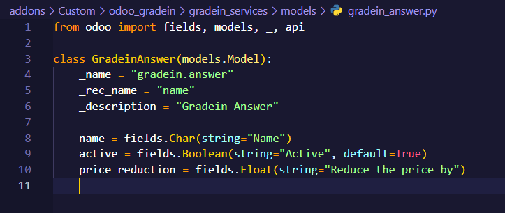

# README - Modelo de Odoo con Python para GradeIn Service

Gracias por elegir nuestra aplicación para gestionar eficientemente los procesos de canje de celulares. A continuación, encontrarás información útil para comenzar.

## **Modelo gradein_answer**

### Objetivo

El modelo Gradein Answer es esencial en nuestra aplicación para gestionar de manera efectiva las respuestas asociadas al modelo de preguntas. Este modelo está diseñado con campos específicos que son fundamentales para la configuración de la vista y garantizar una experiencia de usuario fluida.

### Estructura del Modelo

### Campos Principales

- Name (Char):
    - Descripción: Texto de la respuesta.
    - Requerido: Sí.
- Active (Boolean):
    - Elemento anidado
- Price_reduction (Float):
    - Descripción: Cantidad para reducir el precio.
    - Valor predeterminado: 0.0.

### Criterios de Aceptación

- Funcionalidad Básica:
    - La aplicación debe permitir la creación y edición de respuestas a través de la interfaz del vendedor.
    - La respuesta debe contener un campo de texto (name) que sea obligatorio y única.
    - El estado de activación/desactivación (active) debe reflejarse correctamente en la interfaz y afectar la disponibilidad de la respuesta.

- Reducción de Precio:
    - El campo price_reduction debe ser editable y permitir valores numéricos.
    - La introducción de un valor en price_reduction debe reflejarse correctamente en la interfaz y en el modelo de datos. 

- Recuperación de Datos: La aplicación debe ser capaz de recuperar y mostrar correctamente las respuestas almacenadas en el modelo Gradein Answer. 

- Métodos y Lógica Adicional: Los métodos y la lógica adicionales, si se implementan, deben ejecutarse según lo previsto sin errores ni efectos secundarios no deseados. 

- Integración con el Modelo de Preguntas: La aplicación debe integrarse correctamente con el modelo de preguntas (gradein.question) y permitir la asociación correcta de respuestas a preguntas.

### Proceso de Aceptación

- Pruebas Manuales: Se realizarán pruebas manuales exhaustivas para verificar cada uno de los criterios de aceptación mencionados anteriormente.

- Revisión del Código: El código asociado al modelo Gradein Answer será revisado para asegurar buenas prácticas de programación, coherencia y legibilidad.

- Revisión de Documentación: La documentación asociada al modelo y cualquier instrucción de configuración también será revisada.

- Validación del Usuario Final: Se llevará a cabo una validación final con usuarios finales para garantizar que la aplicación cumple con sus expectativas y necesidades.

---
© Squad 1